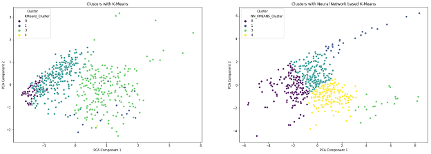
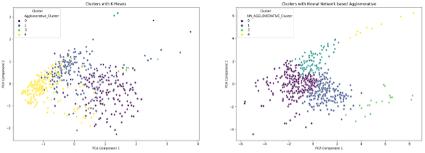

#neural-network-based-job-title-clustering

# Enhancing Job Title Categorization through Neural Network-Based Clustering and Dimensionality Reduction

In the current job market, categorizing job titles and their corresponding descriptions is crucial for streamlining the job search process for candidates. Traditional clustering methods often struggle with the high dimensionality or nuanced textual data found in job listings. This project addresses the challenge of clustering job titles along with the job description by leveraging advanced data processing technique of neural networks. The dataset used comprises multiple job posting parameters like job titles and descriptions of different data science related jobs from Indeed USA. 
The main challenge was the complex nature of interpreting textual data, making traditional clustering methods less effective. To tackle this, the data underwent preprocessing steps like transforming it into a numerical format using Term Frequency-Inverse Document Frequency (TF-IDF) vectorization. The TF-IDF vectors are high-dimensional, which prompted the use of an autoencoder – a type of neural network known for its efficiency in dimensionality reduction and feature extraction. The autoencoder, designed with an encoding layer of 64 dimensions, was trained to compress and reconstruct the high-dimensional TF-IDF vectors, effectively capturing the essence of the job titles and descriptions in a lower-dimensional space. Post training, the encoded vectors obtained using autoencoder was then provided to the K-Means and Agglomerative clustering algorithm. The optimal number of clusters was set to five, based on an understanding of the job market segmentation. The distinctness of the clustering was measured using the silhouette score, a measure of how similar a job title is to its own cluster compared to remaining other clusters. The results showed clear clustering of job titles and descriptions, indicating the effectiveness of the neural network-based approach in handling complex textual data. Each cluster represented a unique category of job listings, potentially simplifying the job-seeking process by categorizing vast numbers of listings into understandable and coherent groups. This approach demonstrates the potential of combining neural networks with traditional clustering algorithms to address the challenges of high-dimensional and complex data clustering. It opens avenues for further exploration and refinement in the domain of job market analytics and can also be a valuable tool for job boards and recruitment platforms.
Preliminary results indicate distinct groupings of job titles, suggesting the potential for improved job search efficiency.

# Methodology 
 

### Data Collection 
To be able to analyze the various job postings, it begins with the collection of job postings data from various platforms. In an ideal scenario, this would involve directly scraping current listings from popular online job platforms such as LinkedIn and Indeed. These websites are rich sources of up-to-date job postings, providing a wide array of job titles and descriptions that reflect the current job market. However, web scraping presents challenges such as the complexity of extracting web elements and the significant time required to gather a comprehensive dataset. 
To overcome these obstacles and expedite the research, I sourced a dataset from Kaggle that includes an extensive collection of data science job postings. This dataset contains relevant parameters such as job titles, descriptions, and company information, which are essential for our analysis. 
 

### Data Preprocessing 
The preprocessing stage is critical for converting the raw data into a format that is readable by various algorithms. Considering that the job posting data consists of various subsections like skills, requirements, qualification and so forth, it is important to preprocess this data accordingly. This process involves combining the job title and description for each listing to create a unified text corpus. Each combined text is then transformed into lowercase to eliminate case sensitivity issues. The next crucial step is to group the data by job title, merging all descriptions for identical roles. This approach ensures that variations of the same job title are treated as a single entity, allowing for a more accurate clustering and analysis. 
 
### Feature Extraction 
The preprocessed text data is then subjected to feature extraction using the TF-IDF (Term Frequency-Inverse Document Frequency) vectorization method. TF-IDF is a statistical measure used to evaluate the importance of a word in the context of a document or corpus. The rationale behind its use is that high-frequency terms within a particular job posting are given higher weights. This technique transforms the text into a numerical feature vector, where each dimension corresponds to a term's relevance to the document's context.
 
### Clustering Algorithms 
Upon transforming job titles and descriptions into numerical feature vectors via TF-IDF vectorization, I proceed to the task of clustering. Initially, I employ K-Means clustering, choosing a preliminary number of five clusters. Each job title is allocated to the nearest cluster centroid. 
Simultaneously, I implement Agglomerative Clustering, which takes a hierarchical approach to group job titles. This technique treats each job title as an individual cluster and then incrementally merges clusters based on their proximity until a singular, comprehensive cluster is achieved. These methods provide a baseline for understanding the natural groupings within the data. 
 
### Neural Network-Based Clustering Approach 

Acknowledging the challenges in clustering high-dimensional data with complex features, we adopt a novel approach - Neural Network-Based Clustering. This strategy involves an additional preprocessing step where we use a neural network, specifically an autoencoder, to reduce the dimensionality of our feature set. By learning a compressed representation of our data, the autoencoder aids in distilling the most salient features, thereby simplifying the clustering task. 
With a lower-dimensional input, we revisit the clustering process, applying both K-Means and Agglomerative Clustering to these newly encoded vectors. This approach allows for a more refined clustering experience, potentially leading to more distinct and interpretable groupings. 
 
### Evaluation 
The evaluation phase is twofold. Firstly, we assess the clustering quality using the silhouette score, which provides insight into the cohesion of clusters. A higher silhouette score suggests that the job titles are well-matched within their clusters and distinctly separated from other clusters. 
Secondly, we employ visualization techniques for an intuitive understanding of the clusters' distribution. Considering the high-dimensional nature of our feature space, we utilize Principal Component Analysis (PCA) to reduce the data to two or three dimensions suitable for graphical representation. By plotting these PCA-reduced clusters, we can visually verify the efficacy of our clustering and the distinction between different job groupings. This multi-layered evaluation, combining both quantitative and visual methods, ensures a comprehensive analysis of our clustering approach's effectiveness. It validates the use of neural network-based dimensionality reduction as a precursor to clustering in handling complex datasets.

